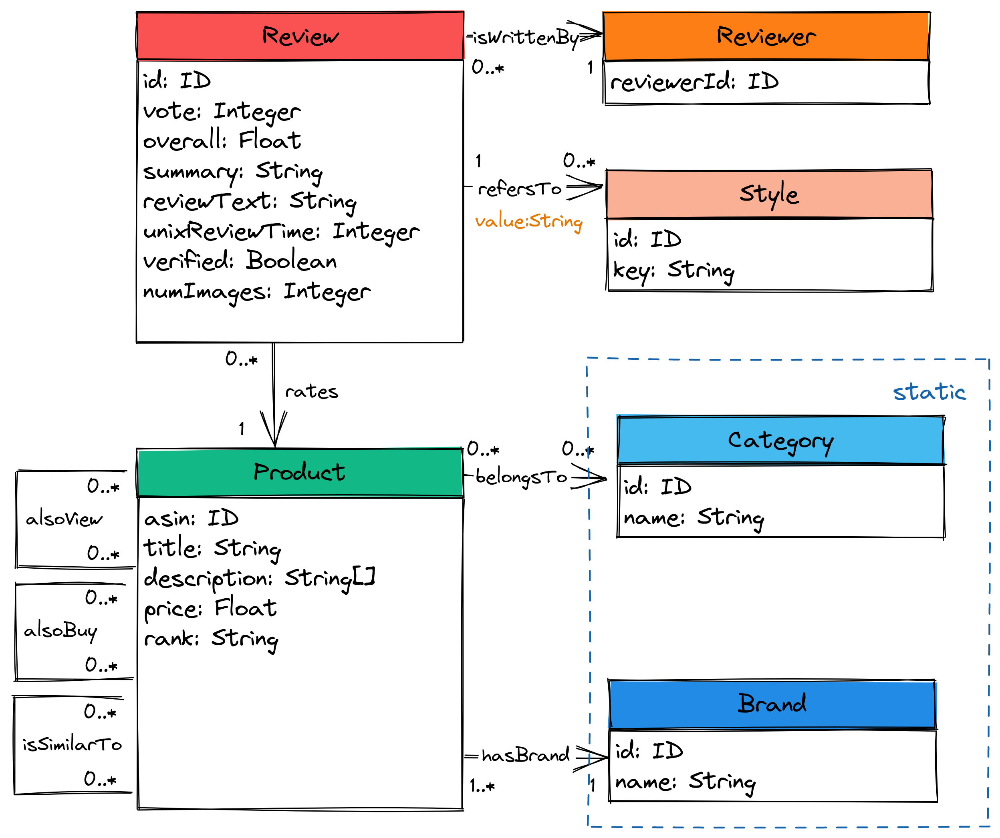
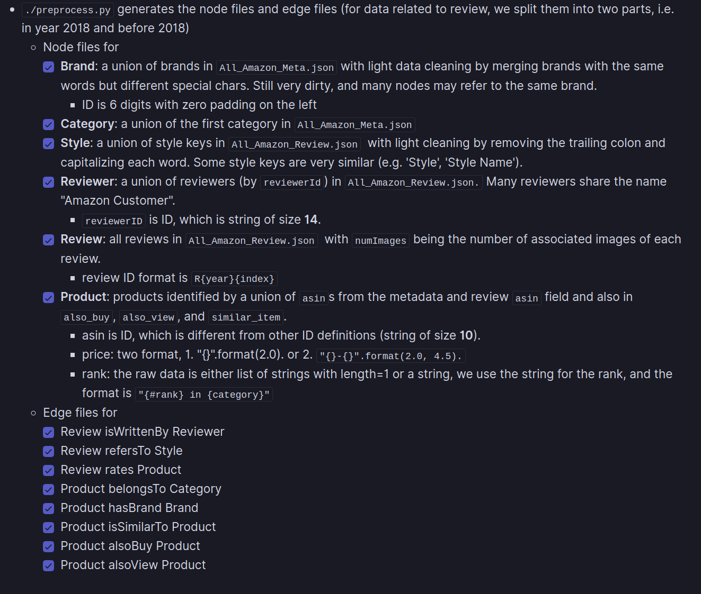

# Amazon Product Review Data neo4j loader

## Acknowledgement

This original data is from https://nijianmo.github.io/amazon/.

The schema in the downloaded files are slightly different from the schema explained on the webpage. Our data loader is implemented under the following schema.

Metadata
- category
- title
- asin
- image
- brand
- rank
- description
- also\_view
- also\_buy
- price
- similar\_item
- main\_cat (unused)
- details (unused)
- feature (unused)
- tech1 (unused)
- date (unused)
- tech2 (unused)
- fit (unused)

Review (the year range must be 1996-2018)
- overall
- verified
- reviewerID
- asin
- reviewerName
- reviewText
- summary
- unixReviewTime
- vote
- image
- style
- reviewTime (unused)

### Citation

- Justifying recommendations using distantly-labeled reviews and fined-grained aspects. Jianmo Ni, Jiacheng Li, and Julian McAuley. Empirical Methods in Natural Language Processing (EMNLP), 2019

## Quick guide

** Disclaimer: the codes are not thoroughly tested and subject to change. **

``` bash
# 1. download this repo
git clone https://github.com/TatianaJin/amazon_product_review_neo4j.git
cd amazon_product_review_neo4j

# 2. download JSON files for the whole data set (optional)
bash amazon_product_review_2018.sh

# 3. set neo4j home (set the path to your own neo4j installation), we assume the import dir is ${NEO4J_HOME}/import
export NEO4J_HOME=/home/neo4j/neo4j-community-4.4.12

# 4. preprocess data
./neo4j_loader/preprocess.py

# ... or alternatively, pass your own meta.json and review.json files
cd neo4j_loader
python -c 'from preprocess import main; main("/path/to/meta.json","/path/to/review.json")'

# 5. import data (must ensure that the target database is empty. check neo4j-admin import guide for reference)
./neo4j_loader/import.py
```

In `neo4j_loader/utils.py`, we hard code the line counts of the review and meta files for showing the progress bar during preprocessing. The numbers need to be changed for proper progress bar display if different data is used.


## Graph construction logic

The property graph schema is shown as follows.



The data is cleaned as follows.



## Improvement

Instead of decompressing the `.json.gz` files and read lines of the text file for processing, we may use the gzip library in python to directly read lines for better speed.
Yet for now, the implementation under `neo4j_loader` reads the text file for debug purpose, since the data cleaning process is prone to dirty unexpected data, and we rely on manual checking.
